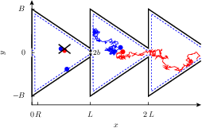
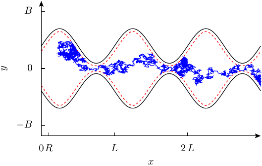
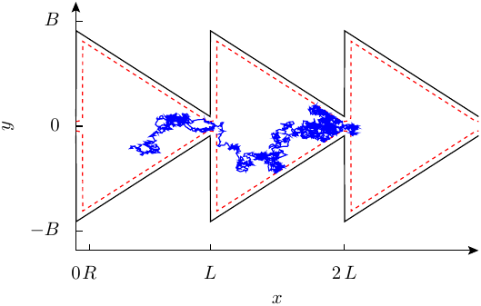
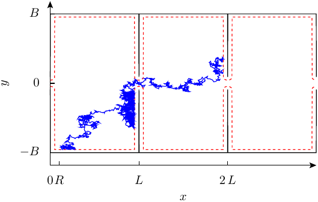

# Spatially Confined Brownian Motion

Simulation code for interacting and non-interacting Brownian particles in 2D periodic channels.
The particles undergo overdamped Brownian motion simulated via a stochastic Euler scheme.
Different channel shapes as well as types of particle-particle interactions are available and can
be chosen by compilation.
Periodic boundary conditions are used, and particle density is kept constant in the interacting case.

<p align="center">
  
</p>

---

## ⚙️ Compilation & Execution

The project is compiled using a Makefile and configured via a text file.

### 🔨 Building

To compile the program, navigate to the `src/` directory and run the `make` command:

```bash
cd src/
make
```

This will produce an executable file named `main_brownconf` in the `src/` directory.

You can let you guide towards a makefile that compiles with sources for your intended channel-shapes
and inter-particle forces, with the 'python_tools/dtool_create_header_makefile.py' script:

```bash
cd python_tools/
dtool_create_header_makefile.py
```

Choose the preferred compiler, channel shape and particle-particle interactions from the suggested ones.

### Parameters & Configuration

Simulation parameters are controlled via a configuration file. The default file is `sim_params.conf`.

-   To run a simulation with the default parameters, simply execute the program:
    ```bash
    ./main_brownconf
    ```
-   To use a custom configuration file, pass its path as a command-line argument:
    ```bash
    ./main_brownconf my_custom.conf
    ```

The configuration file uses a simple `key = value` format. For example:
```
# Simulation Parameters
F = 10.0
parts_per_set = 1
N = 100
```
This approach allows for easy modification of simulation parameters without needing to recompile the code.

If **MPI** is available, the code can be parallelized by uncommenting the `MPI_ON` flag in the source files where it appears.

---

## 📂 Project Structure

The repository consists of four main directories:

1.  **`src/`**
    -   Contains the main simulation code, Makefile, and configuration files.
    -   Each simulation run creates a new directory under `../runs/` containing the code and data for that run.

2.  **`doxygen/`**
    -   Contains the [Doxygen](https://www.doxygen.nl/) configuration for generating documentation.
    -   Run `doxygen` to generate HTML and PDF (via LaTeX) documentation.

3.  **`profiling/`**
    -   Provides an environment for performance profiling with **gprof**. See the README inside for details.

4.  **`visualization/`**
    -   Contains subdirectories with Python scripts and C-wrappers for different types of data visualization:
        -   **`Histograms/`**: Scripts for generating 2D histograms of particle positions.
        -   **`Mobility_over_time/`**: Scripts for plotting the time-dependent mobility of the particles.
        -   **`Trajectories/`**: Tools and scripts for visualizing particle trajectories, including C-wrappers for efficient coordinate wrapping.

---
## Code Modules

The code is modular to support different physical models:
-   **Channel Shapes:** Modules prefixed with `conf_` define the geometry of the confinement.
    -   **Cosine Confinement** (`conf_cos.c`, Phys.Rev.E 83 (2011) 051135, https://doi.org/10.1103/PhysRevE.83.051135):
        <p align="left">
          
        </p>
    -   **Splitter Confinement** (`conf_splitter.c`, J. Chem. Phys. 141, 074104 (2014), https://doi.org/10.1063/1.4892615):
        <p align="left">
          
        </p>
    -   **Septum Confinement** (`conf_sept.c`, J. Chem. Phys. 134, 051101 (2011), https://doi.org/10.1016/j.chemphys.2010.03.022):
        <p align="left">
          
        </p>
-   **Particle Interactions:** Modules prefixed with `int_` define the interaction potential between particles, such as hard-core (`int_hardspheres.c`) or Lennard-Jones (`int_lennardjones.c`).
